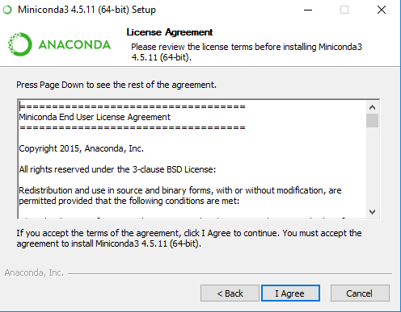

# Installation de Jupyter sur Windows 10 (avec Miniconda)

## Installation de Miniconda

#### Ouvrez un navigateur web à l'adresse

 <https://conda.io/miniconda.html>

Téléchargez le programme d'installation de Miniconda pour Python 3.7 et Windows 64-bit


#### Lancez le programme d'installation

Fichier `Miniconda3-latest-Windows-x86_64`


#### Validez la licence d'utilisation



#### N'installez Miniconda que pour vous


#### Laissez le répertoire d'installation par défaut (tel que proposé par l'installateur)


#### Laissez les autres paramètres par défaut


#### L'installation de Miniconda va prendre quelques minutes


Comptez 5 minutes

#### Validez la fin de l'installation

en décochant les deux cases


## Installation de Jupyter

#### Lancez l'invite de commande Miniconda

depuis le menu Windows


pour obtenir


### Installez Jupyter

avec la commande :

```
conda install -y -c conda-forge jupyterlab
```

puis R pour que Jupyter puisse manipuler des notebooks R :

```
conda install -y -c r r-essentials
```


## Utilisation de Jupyter

#### Lancez l'invite de commande Miniconda

depuis le menu Windows


pour obtenir


#### Lancez les notebooks Jupyter

Tapez la commande :

```
jupyter notebook
```

Un nouvel onglet va s'ouvrir dans votre navigateur web.


#### Lancez Jupyter lab

Tapez la commande :

```
jupyter lab
```

Un nouvel onglet va s'ouvrir dans votre navigateur web.


## Arrêter / quitter Jupyter (notebook ou lab)

Revenez dans l'invite de commande Miniconda et appuyez deux fois sur la combinaison de touches `Ctrl + C`


